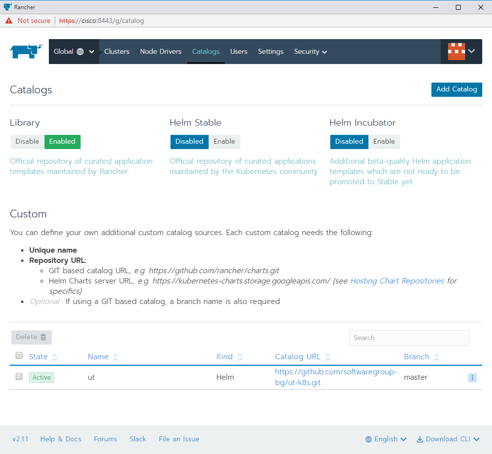
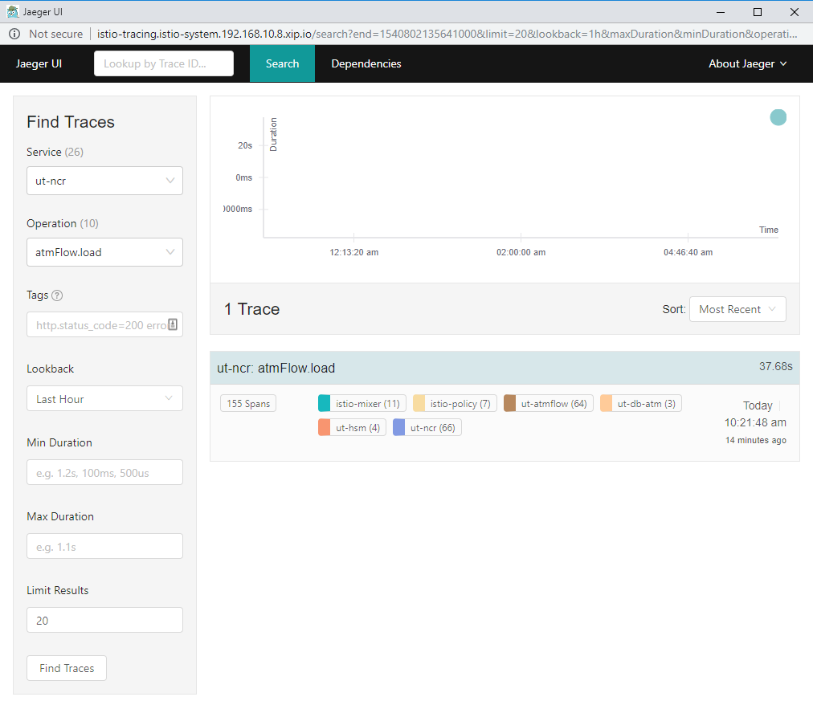

# Cluster installation

## Rancher

To install Rancher you need a host with supported docker running.
We are going to install Rancher on a host named `cisco`.

1) Before deploying Rancher, you may need to run the following command, to avoid
  getting error `Path /var/lib/kubelet is mounted on / but it is not a shared mount`.
  For more info see the following issues in
  [rancher](https://github.com/rancher/rancher/issues/12205#issuecomment-385661588)
  and [kubernetes](https://github.com/kubernetes/kubernetes/issues/61058#issuecomment-372764783)

    ```bash
    sudo mount --make-rshared /
    ```

1) Deploy Rancher as per documentation. The instructions below were tested with
  Rancher version 2.1.1. Make sure you map to host ports 8080 and 8443,
  as 80 and 443 will be used by an ingress controller.

    ```bash
    sudo docker run -d --restart=unless-stopped -p 8080:80 -p 8443:443 rancher/rancher:v2.1.1
    ```

1) In a few moments you should be able to open the URL
  ([https://cisco:8443](https://cisco:8443) in our example), where
  the Rancher GUI should appear. You will be asked to set the
  admin password:
  
  and Rancher URL:
  
  After confirming, you should see the empty Clusters screen:
  

## Cluster node

To create a cluster, one or more nodes need to be added to the cluster.
The following steps will create a cluster from one or more nodes.
Each node need to have docker running and be able to see the `cisco`
host, where Rancher was previously installed. Cluster can be made from
single node (the same that runs Rancher) for test purposes.

1) Click the `Add Cluster` button to create a cluster. Select `Custom` and
  fill the cluster name. In the example we use a name `dev`:
  
1) On next step, if you are creating single node cluster, make sure to
  select all the boxes: `etcd`, `Control Plane` and `worker`:
  
1) Copy the docker command, as shown on the same screen and run
  it on the node, which you want to add to the cluster. It will
  look similar to this:

    ```bash
    sudo docker run -d --privileged \
      --restart=unless-stopped --net=host \
      -v /etc/kubernetes:/etc/kubernetes \
      -v /var/run:/var/run \
      rancher/rancher-agent:v2.1.1 \
      --server https://cisco:8443 \
      --token gk... \
      --ca-checksum 6e... \
      --worker
    ```

1) Click on the `Done` button and you should be able to see
  the cluster in `Provisioning` state:
  

1) When installation finishes, the `Clusters` screen, will show more
  details for the cluster, like available CPU cores and RAM:
  

1) If you click on the cluster name (`dev`), you should be able to see
  the cluster dashboard, including further details and inspect
  it. While installation is not complete, the screen looks like this:
  
  After installation completes, the screen will show more details:
  

1) Clicking on the `Nodes` menu at the top will show information
  about all nodes in the selected cluster:
  

1) Clicking on a specific node will show more details about the node:
  

1) The cluster can be controlled from the Rancher graphical interface,
  which also includes functionality to run `kubectl` directly in
  the cluster, by clicking the `Launch kubectl` button in the
  cluster dashboard. Alternatively `kubectl` can be run on another
  machine, that can has network access to the node, where Rancher
  was installed, i.e. `cisco` in this exampl. To be able to run
  `kubectl`, this machine needs certain configuration in the
  file `~/.kube/config`. To get the configuration, click on the
  `Kubeconfig File` button, which will show the configuration,
  ready for copying:
  
  After saving this in the `~/.kube/config` configuration file, you
  can execute the command kubectl cluster-info to verify that you
  have access to the cluster. It should show result similar to this:

    ```bash
      $ kubectl cluster-info
      Kubernetes master is running at https://cisco:8443/k8s/clusters/c-rz2lz
      KubeDNS is running at https://cisco:8443/k8s/clusters/c-rz2lz/api/v1/namespaces/kube-system/services/kube-dns:dns/proxy

      To further debug and diagnose cluster problems, use 'kubectl cluster-info dump'.
    ```

## Helm

You can use [Helm](https://helm.sh/) to install applications in the
cluster from the command line. A quick way to install helm
for development purposes and give it  full admin access to the
cluster is to run the following commands:

```bash
$ kubectl create serviceaccount --namespace kube-system tiller
$ kubectl create clusterrolebinding tiller-cluster-rule \
  --clusterrole=cluster-admin --serviceaccount=kube-system:tiller
$ helm init --service-account tiller
```

After this, Run `helm version` to check the installation.
For production use, consult helm docs, which provide more details
about configuring the proper access.

## Using Rancher catalogs

Rancher provides a graphical interface for installing applications
in the cluster. It is alternative to helm and allows a convenient
way to pass configuration parameters for the installation.
Rancher has built-in catalog of applications, but also allows
additional catalogs to be added. To do so, while in the global
menu, click on the `Catalogs` menu, then on `Add Catalog` button.
There you should provide URL to the catalog (which is git URL):


After installation, the catalog should appear in the list:



## Istio

[Istio](https://istio.io/) is an open source service mesh, which lets
you you connect, secure, control and observe services in the cluster.
Rancher catalog includes Istio, which makes the installation
relatively easy. Use the following steps for easy way to install and
later access the apps, included in Istio:

### Istio Installation

1) Go to `System` project, click on `Catalog Apps` menu:
  

1) Click `Launch` button, from the application list click on the
  `Details` button under `Istio`. This will show a launch screen.
  Under the `Configuration Options` section make sure you select
  a stable version of `Istio`. To do so, select `False` for
  `Use Default Image` and then put proper tag of a stable `Istio`
  version (for example 1.0.2):
  

1) For the other options, select:
    - Enable Auto Sidecar Injector: True
    - Enable the Prometheus Server: True
    - Enable Grafana: True
    - Enable the Jaeger and Kiali server and make sure
    to also expose them using Layer 7 Load Balancer and Automatically
    generate a `.xip.io` hostname.

1) Click the `Launch` button, then `Istio` installation will start and
  progress will be shown:
  

1) Run the following command to enable Istio sidecar injection in
  the `default` namespace:

    ```bash
    kubectl label namespace default istio-injection=enabled
    ```

1) For easier access to Istio apps, it is recommended to edit ingress
  setting for istio-tracing and to add ingress for Grafana. To do so
  click on the `Workloads` menu, then select the `Load Balancing` tab.
  Edit `istio-tracing` by clicking on the three dots button and selecting
  `Edit`. Change it as per the next screenshot:
  
  Save and then click `Add Ingress` to add entry for `Grafana` as per
  the next screenshot:
  

### Istio applications

#### Kiali

Kiali is service mesh obserbability tool. To launch it, click on
the link that was generated, visible in the Load Balancing tab.
The link looks like `http://kiali.istio-system.192.168.10.8.xip.io`
Default user/passrowd are admin/admin. Kiali has many ways to observe
the services, including functionality to generate a graph that
visualises communications across services:


#### Jaeger

Jaeger is a tool to visualise tracing in distributed systems.
To launch it, click on the link that was generated, visible in
the Load Balancing tab. The link looks like
`http://istio-tracing.istio-system.192.168.10.8.xip.io`.
It can show list of captured traces, that can be filtered
by service, operation, time, etc:



It can also show detailed info for each operation, including
nested calls between services and visualise duration of each:


#### Grafana

Grafana is used to visualise various metrics from the service mesh.
To launch it, click on the link that was generated, visible in
the Load Balancing tab. The link looks like
`http://grafana.istio-system.192.168.10.8.xip.io`.
Istio comes with several preconfigured Grafana dashboards, for example
the `Istio Service Dashboard` shows metrics for each service:


## UT Catalog

The catalog in this repository contains 3 applications:
Elasticsearch+FluentBit+Kibana, Sentry and UT microservices
(from impl-standard and impl-ctp),
all of which have various settings preconfigured for easier deployment
in a cluster. To deploy them, while in the `Default` project, click
the `Catalog Apps` menu and select the `UT` catalog that was
added earlier. You should see screen like this:


### Sentry

Sentry is error log aggregation and inspection tool, which helps
in observing and troubleshooting errors.

To install it, follow these steps:

1) Launch it from the `UT` catalog, using the default configuraiton
  options:
  
1) Installation can take around 10 minutes, most of which goes to
  creating the database. After it is installed add ingress by clicking
  the `Add ingress` button, from the `Workloads` menu,
  tab `Load Balancing`. Configure it per the following screenshot:
  
1) The password for accessing the Sentry UI can be obtained from the
  menu `Resources\Secrets`, selecting the secred named `sentry-sentry`.
  Password can be copied from the screen that will be shown:
  
1) Login in `Sentry`, by opening the link, that was generated in the
  `Load Balancing` screen. Username is `admin@sentry.local`, password
  is taken from the previous step:
  
1) To complete the setup, enter information in the next screen, as
  shown on the following screenshot. Root URL is important to be set
  to `http://sentry-sentry.sentry:9000` as shown on the screenshot:
  
1) After logging in create project in Sentry by clicking
  `add new\project` at top right. Enter project name and click
   `Create Project` button.
1) After project is creted, open it and go to `Settings` tab, then
  click on the `Client Keys (DSN)` where DSN can be obtained and later
  used to install UT microservices:
  

`UT` microservices errors logged in `Sentry` include tags for
environment (dev/env/uat/prod), context(port type), method,
release version, host name, service name and call stack,
as shown in the follwing screenshots:


### Elasticsearch + FluentBit + Kibana

To install Elasticserach, FluentBit and Kibana, select the `efk` item
from the `UT` catalog. Currently it is configured to use minimal
resources, suitable for development purposes, so features like
clustering, data persistence, etc. are turned off by default.
Note that you do not need to enable `Fluent-Bit` option, as `UT`
microservices can talk to elasticsearch directly. Enabling that option
activates aggregation of logs produced by Docker.

After installation is complete, there should be a link available in the
`Load balancing` tab, which can be used to open the `Kibana` UI.
The link should look like `http://efk-kibana.efk.192.168.10.8.xip.io`

After opening `Kibana` make sure that you create an index.
Note that to create index, some log data needs to exists, so
this means that `UT` or other app needs to send logs to
Elasticsearch first. Adding index can be done from the management menu:


When inspecting log entries generated by `UT` microservices, the
following fields can be useful:

- @meta.opcode - the type of log
- @meta.method - method being executed
- service - UT microservice
- context - type of port (SQL ,HTTP , script, etc)
- name - name of port
- error.type - for errors, shows the error type
- msg - Message associated with the log entry
  (for example error message)

The following screenshot shows example of using some of these fields:


### UT

`UT` microsevices can be launched from the `UT` catalog.
When launching, it allows for setting parameters like
`environment` (dev/test/uat/prod), `Sentry DSN` and `Elasticsearch
host`, as shown in the following screenshot:


After launching, the list of started pods shows the individual
microservices:


In addition to the microservices, a log console is also included
and can be used for real-time monitoring of all microservices:


